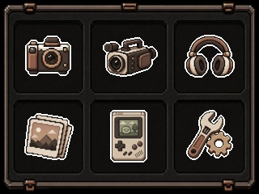

# KC02 Firmware Mod

Replace the stock kids UI on the [HiMont KC02 (U8) Kids Instant Print Camera](https://www.himont.us/products/kids-instant-camera-u8) with custom themes. Swap every icon, background, boot screen, photo frame overlay, and digit — dump supported firmware over USB and flash via SD card, without opening the camera. A SPI programmer remains the fallback for unsupported firmware and recovery.

Also sold on [Amazon](https://www.amazon.com/HiMont-Camera-Instant-Selfie-Digital/dp/B0DDGWPVJM) (not an affiliate link).

<table align="center">
  <tr>
    <th align="center">Before (stock)</th>
    <th align="center">After (modded)</th>
  </tr>
  <tr>
    <td align="center"></td>
    <td align="center"></td>
  </tr>
</table>

## Background

I bought two of these cameras (one to sacrifice) and decided to reverse engineer the firmware to fully revamp UI. 

Here are some of the things and challenges I went through:

1. **Disassembly** — Pried off the black front cover (the side with the display and buttons), unscrewed the PCB, and located the flash chip (Zetta 25VQ32).
2. **Firmware dump** — Clipped an SOIC8 clip onto the flash chip, connected a CH341A USB programmer, and used `flashrom` to dump the full 4MB SPI flash to a `.bin` file.
3. **Reverse engineering** — Built a suite of Python tools to parse the firmware structure, locate the asset table (SFAT), extract all embedded images and sounds, and patch replacements back in.
4. **Theme creation** — Designed pixel art in [Aseprite](https://www.aseprite.org/) and built tooling to handle all the firmware format quirks (exact byte sizes, chroma key transparency, JPEG subsampling requirements).
5. **Iteration** — Lots of test flashes, a few bricks (recovered via CH341A), and gradually mapped out what's safe to modify and what isn't.

### Practical tips

- **Buy two cameras.** Use one for testing and keep the other stock. If you brick the test unit, you can recover with the SPI programmer, but having a working reference saves time.
- **Disconnect the battery when using a SPI programmer.** The camera must stay powered for USB dumps; disconnect the battery only for direct chip reads/writes.
- **Keep your original dump backed up.** If the SD update routine gets corrupted (it lives in the app code, not the bootloader), the camera can't self-recover. The CH341A + your backup dump is the only way back.

## Hardware

| Part | Detail |
|------|--------|
| SoC | JieLi AC2546 (pi32 core) |
| Flash | Zetta 25VQ32, 4MB SPI NOR |
| LCD | 320x240, 2.4" IPS |
| Sensor | H63P |
| Buttons | ADC-based (6 buttons on single analog pin) |

This camera is sold under various brand names. If your camera has the same internals (check the SoC and flash chip), this toolkit will likely work.

## Requirements

- Python 3.9+
- Pillow (`pip install Pillow`) — for menu background compositing
- A USB data cable, PyUSB and libusb (`python3 -m pip install pyusb libusb-package`) — for USB dumps
- A CH341A USB SPI programmer + SOIC8 clip — optional fallback for dumping, required for recovery
- A FAT32-formatted SD card — for flashing

## USB device permissions and drivers

Install the USB dependencies with `python3 -m pip install pyusb libusb-package` (Windows: `py -3 -m pip install pyusb libusb-package`). Use a virtual environment if your system Python is externally managed. `libusb-package` supplies the USB library, not OS permissions or a Windows device driver.

Connect a USB **data** cable, power on the camera, and leave it idle on its USB/SD screen. **The SD card can stay inserted.** Eject/unmount any mounted camera volumes before dumping so the OS does not access them while the tool owns the mass-storage interface. Close camera/video apps and file-manager windows. Ensure the card does not contain `DestBin.bin` before powering on, since that filename triggers a firmware update.

Supported mass-storage IDs are `0219:3280` and `1908:3283`. Webcam-only mode (`1908:3282`) cannot dump firmware.

### Linux

If necessary, install your distribution's libusb 1.0 runtime (`sudo apt install libusb-1.0-0` on Debian/Ubuntu). To grant USB access without running the tool as root, create `/etc/udev/rules.d/70-kc02.rules` with:

```udev
SUBSYSTEM=="usb", ATTR{idVendor}=="0219", ATTR{idProduct}=="3280", MODE="0660", TAG+="uaccess"
SUBSYSTEM=="usb", ATTR{idVendor}=="1908", ATTR{idProduct}=="3283", MODE="0660", TAG+="uaccess"
```

Reload the rules, then unplug/reconnect the camera:

```bash
sudo udevadm control --reload-rules
```

`uaccess` grants access to the active local desktop user. For SSH/headless use, add `GROUP="plugdev"` (or a dedicated group) to both rules, join that group, and log in again. The tool detaches `usb-storage` from interface 4 while dumping and attempts to reattach it on exit.

### macOS

Use `libusb-package`, or install the system backend with `brew install libusb`. No udev rules or replacement Windows drivers apply. Eject the camera's mounted SD volumes in Finder/Disk Utility and close camera apps before dumping; the card can remain in the camera.

If the interface remains busy, reconnect the camera and retry. Some macOS versions keep their mass-storage driver attached even after ejecting a volume, and libusb cannot detach it on every version. Running with `sudo` does not resolve driver ownership. If claiming remains blocked, use the SPI-programmer fallback below. macOS hardware validation is still pending.

### Windows

Install **WinUSB** for the camera's mass-storage interface using [Zadig](https://zadig.akeo.ie/):

1. Enable **Options > List All Devices**.
2. Select only the KC02 mass-storage interface (interface 4, sometimes shown as `MI_04`). Verify VID:PID `0219:3280` or `1908:3283`. Plain mass-storage mode may show the whole KC02 rather than `MI_04`; check its hardware ID.
3. Choose **WinUSB** and install/replace the driver. This step requires administrator permission; normal dumping does not.

Do not replace a webcam/audio interface, USB hub, or another disk's driver. Replacing the mass-storage driver disables ordinary camera SD-card access on this PC. To restore it, uninstall the replacement driver through Device Manager and reconnect the camera so Windows can load USB Mass Storage again.

Use Python and libusb of matching architecture; `libusb-package` provides matching binaries for supported platforms. Running the dump as administrator does not fix a missing WinUSB driver. Windows hardware validation is still pending.

## Getting Started

### 1. Dump your original firmware

**This is required.** The build tool patches your theme assets onto your original firmware dump — it can't generate a firmware from scratch. Without the dump, nothing else works.

We don't distribute the stock firmware (it's copyrighted). Dump your own camera over USB:

```bash
python3 -m pip install pyusb libusb-package
python3 tools/dump_firmware.py  # saves firmware/original.bin
```

On Windows, use `py -3` instead of `python3`. Follow [USB device permissions and drivers](#usb-device-permissions-and-drivers), connect a USB **data** cable, power on, and leave the camera idle on its USB/SD screen. You do not need to remove the SD card. The self-contained script checks the researched firmware layout, loads a temporary RAM-only SPI-read adapter, and compares two complete reads before saving. It checks the boot header and SFAT marker; verbose mode also prints a SHA-256 checksum. It does not write flash. If the camera stops responding, power-cycle it before retrying.

Use `-o backup.bin` to choose a destination, `--list` and `--device NUMBER` to select among cameras, or `--force` to replace an existing backup after a successful dump. `--single-read` skips the second comparison. Run `--help` for all options. Failed or interrupted dumps remove temporary data and any incomplete output created by this run. Existing backups remain untouched on dump failure.

Save the dump to your computer, not directly to the camera's mounted SD card: the dumper takes ownership of the USB mass-storage interface, so camera volumes must be unmounted during dumping. Keep your backup under a name other than `DestBin.bin` to avoid accidental flashing; the dumper rejects that output filename because the camera treats it as an update on startup.

**To deliberately restore the original firmware later**, copy the verified backup from that camera to a FAT32 SD card's root as `DestBin.bin`, then follow [the flashing steps](#4-flash-it). Keep a separate backup on your computer, use reliable power, and do not interrupt the update—it overwrites the bootloader too. SD restoration requires the currently installed firmware's update routine to work; if it is broken, use a SPI programmer instead.

For unsupported firmware or USB driver issues, use a CH341A SPI programmer and SOIC8 clip instead. **Disconnect the camera battery first**:

```bash
# macOS (install flashrom via Homebrew)
brew install flashrom
flashrom -p ch341a_spi -r firmware/original.bin

# Verify — dump it twice and compare
flashrom -p ch341a_spi -r firmware/verify.bin
md5 firmware/original.bin firmware/verify.bin  # must match
```

The dump should be exactly 4,194,304 bytes (4MB).

**Keep a backup somewhere safe.** If you brick the camera, this is your only recovery path (flash it back via CH341A).

### 2. Extract the original assets

```bash
python3 tools/extract_assets.py firmware/original.bin
```

This reads the SFAT asset table from the firmware and extracts all 97 embedded assets (BMPs, JPEGs, WAVs, raw data) into `originals/`. You'll use these as size references when creating replacement art.

### 3. Build a themed firmware

```bash
# Build using the included theme
python3 tools/build.py build

# Build and copy straight to SD card
python3 tools/build.py build --sd

# See all available slots
python3 tools/build.py list
```

The build tool reads your original dump, replaces matching assets from the theme directory, removes menu text labels, and writes `patched/DestBin.bin`.

### 4. Flash it

1. Format an SD card as FAT32
2. Copy `patched/DestBin.bin` to the SD card root
3. Insert the SD card and power on the camera
4. The camera flashes itself and reboots with the new firmware

If `--sd` is passed to the build command, it copies to `/Volumes/NO NAME` (the default FAT32 volume name on macOS) and ejects automatically.

## Tools

| Tool | What it does |
|------|-------------|
| `tools/dump_firmware.py` | Self-contained USB firmware backup CLI, with two-read verification |
| `tools/build.py` | Build `DestBin.bin` from dump + theme assets. Supports button remapping, handler swaps, icon repositioning, and raw data patches. |
| `tools/extract_assets.py` | Extract all assets from a firmware dump using the SFAT table |
| `tools/compare.py` | Web UI (localhost:8080) — the main workspace for theme development |
| `tools/analyze.py` | Firmware structure analysis — find assets, map regions, detect formats |
| `tools/pi32_disasm.py` | pi32 disassembler for the JieLi CPU core |
| `tools/xrefdb.py` | Cross-reference database for firmware code analysis |
| `tools/ghidra_import.py` | Import labels/comments into Ghidra for RE work |
| `tools/ghidra_label.py` | Generate Ghidra label scripts |
| `tools/KC02Labels.java` | Ghidra script for applying KC02-specific labels |

### Compare UI (`tools/compare.py`)

The compare tool is the main workspace for theme development:

```bash
python3 tools/compare.py  # opens at localhost:8080
```

- **Side-by-side comparison** — view every original asset next to its theme replacement
- **Drag-and-drop conversion** — drop any image onto a slot and it auto-converts to the correct format (24bpp BMP or baseline JPEG), applies the chroma key background, and pads to the exact byte size
- **Icon positioning** — move icons around within their canvas using drag or arrow keys, with crosshair and bounding box guides
- **One-click build & flash** — builds the firmware and copies it to your SD card directly from the browser

For creating the pixel art itself, I used [Aseprite](https://www.aseprite.org/) (paid). Any pixel art editor works — the compare tool handles all the firmware format conversion when you drop images in.

### Menu background auto-generation

The main menu background is a composite: the 6 menu icons get rendered on top of a base image. This is necessary because the firmware draws the background first, then overlays icons using chroma key transparency. If the icons aren't baked into the background JPEG, they'll flash or be invisible.

The build tool handles this automatically. Place a `menu_bg_base.png` (or `.jpg`) in your theme's `firmware_exports/` directory and the builder composites all 6 menu icons at their grid positions, then encodes to a correctly-sized JPEG.

## Creating a Theme

A theme is a directory under `themes/` containing replacement assets. See `themes/modern_pixel_light/` for a complete example.

### Directory structure

```
themes/your_theme/
  firmware_exports/     # Ready-to-flash BMPs and JPEGs (exact firmware sizes)
  sources/              # Source artwork (PNGs, any resolution)
  previews/             # Preview images for the theme
  MANIFEST.md           # Asset listing
```

### Asset format rules

**Every replacement must be the exact same byte size as the original.**

**BMP** (icons, digits, controls):
- 24-bit uncompressed, BGR byte order, bottom-up rows
- Chroma key background: `#8C8C8C` (most icons), `#808080` (digits), `#232323` (tiny indicators)
- If your BMP is smaller than the slot, it gets zero-padded automatically

**JPEG** (screens, backgrounds, frames):
- Baseline sequential (SOF0), never progressive
- 4:2:0 chroma subsampling only (4:4:4 causes green screen)
- No EXIF, no ICC profile
- If smaller than the slot, padded with `0xFF` before the EOI marker

### Asset sizes

| Category | Dimensions | Exact bytes | Count |
|----------|-----------|------------|-------|
| Menu icons | 96x96 | 27,704 | 6 |
| Settings selected | 112x112 | 37,688 | 15 |
| Settings unselected | 64x64 | 12,344 | 14 |
| Game icons | 120x120 | 43,256 | 5 |
| Playback controls | 48x32 | 4,662 | 2 |
| Counter digits | 16x32 | 1,590 | 13 |
| Photo frames | 1280x720 | varies | 9 |
| Screens/BGs | 320x240 | varies | ~10 |

Run `python3 tools/build.py list` for the full slot table with exact sizes and firmware offsets.

### File naming

Name files to match slot names (`photo.bmp`, `boot_screen.jpg`) or use the numbered alias format (`01_photo_96.bmp`). The build tool auto-matches both. See `build.py` for the full alias table.

## Build Options

```bash
# Keep stock menu text labels
python3 tools/build.py build --keep-text

# Remap physical buttons
python3 tools/build.py build --remap-button up=down --remap-button down=up

# Swap menu icon positions
python3 tools/build.py build --swap-asset 0=4

# Reposition menu icons
python3 tools/build.py build --move-icons "12,18;112,18;212,18;12,126;112,126;212,126"

# Dry run (show what would change without writing)
python3 tools/build.py build --dry-run

# Write raw data patches (for firmware experiments)
python3 tools/build.py build --raw-patch 0x085010=80020000
```

## Firmware Structure

```
0x000000 - 0x0001FF  Header (BLDR magic, checksum, boot signature)
0x000200 - 0x0D31FF  Executable code (pi32) — DO NOT MODIFY
0x0D3200 - 0x0D350F  Asset table (SFAT) — 97 entries x 8 bytes
0x0D3510 - 0x3FFFFF  Asset data (BMP, JPEG, WAV, raw)
```

The asset data region (0x0D3510+) is the only safe zone for replacement. The code section contains pi32 instructions — modifying bytes there without disassembly will corrupt the firmware and potentially brick the camera.

## Recovery

If you brick the camera (SD update no longer works):

1. Open the camera case
2. Clip the SOIC8 onto the flash chip
3. Flash your backup: `flashrom -p ch341a_spi -w firmware/original.bin`
4. Reassemble and power on

The SD update routine lives in the app code section, not the bootloader. If code gets corrupted, the camera can't self-recover from SD — you'll need the SPI programmer.

## Reverse Engineering

The `reference/ghidra-jieli/` directory contains SLEIGH processor specifications for JieLi's pi32 and pi32v2 CPU cores (originally from [kagaimiq's ghidra-jieli](https://github.com/kagaimiq/ghidra-jieli)). These let you load the firmware into Ghidra for disassembly and analysis.

The `docs/` directory contains detailed firmware documentation:
- `ASSET_CATALOG.md` — all 97 assets mapped with offsets, sizes, and descriptions
- `FIRMWARE_NOTES.md` — flash validation, safe patch zones, memory layout, test results
- `IMAGE_GEN_RULES.md` — exact format specs for BMP and JPEG assets

## Related

- **[canon-2-thermal](https://github.com/6uan/canon-2-thermal)** — Convert images into a format the camera's thermal printer can read and print.

## License

Tools and documentation: MIT. Theme artwork in `themes/` is original and freely usable. The ghidra-jieli SLEIGH specs are from [kagaimiq](https://github.com/kagaimiq/ghidra-jieli) — see that repo for its license terms.

This project does not distribute any copyrighted firmware or original manufacturer assets.
